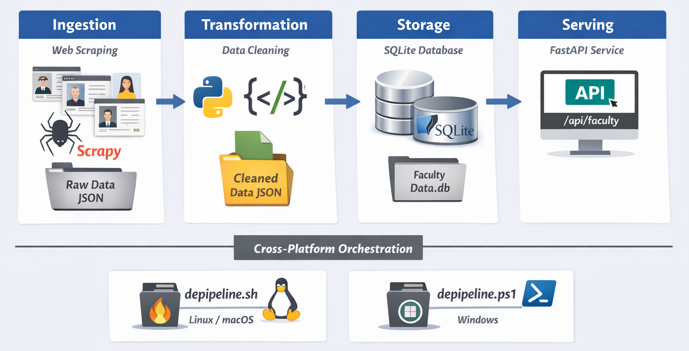

# Faculty Data Engineering Pipeline

## Author
- **Name:** Pallavi Raghuvanshi  
- **Roll No:** 202518026
- **Program:** Msc Data Science 
- **Institution:** DAIICT, Gandhinagar

A complete end-to-end data engineering project designed to scrape faculty information, clean and transform the data, store it in a local database, and serve it via a FastAPI endpoint. This project is built to be cross-platform, running seamlessly on **Windows**, **Linux (Ubuntu)**, and **macOS**.



## Features
* **Automated Scraping:** Uses **Scrapy** to extract faculty details from web sources.
* **Data Transformation:** Cleans raw JSON data into a structured format using Python.
* **Persistent Storage:** Stores processed data in a local **SQLite** database.
* **API Access:** Provides a **FastAPI** server to query and retrieve faculty data via REST endpoints.
* **Cross-Platform Orchestration**: Includes shell scripts (`.sh` for Linux/macOS and `.ps1` for Windows) to automate the entire pipeline.
* **Interactive Research Portal**: A custom-themed Streamlit application (app.py) providing a user-friendly interface for semantic faculty discovery.

## Pipeline Execution Flow
The project is structured into four distinct stages:
* **Ingestion:** Scrapy spiders extract raw data from faculty web pages.
* **Transformation:** Python logic cleans and normalizes the raw data.
* **Storage:** The structured data is loaded into a local SQLite database.
* **Serving:** Data is exposed via a FastAPI REST server and an interactive Streamlit research portal for end-users.

## Project Structure
```text
├── faculty_scraper/          # Scrapy project root
│   ├── __init__.py           # Package initialization
│   ├── spiders/              # Crawler directory
│   │   ├── __init__.py       # Package initialization
│   │   └── faculty_spider.py # Core web scraping logic
│   ├── items.py              # Scraped data containers
│   ├── middlewares.py        # Request/Response processing
│   ├── pipelines.py          # Default (empty) pipelines
│   └── settings.py           # Project configurations
├── local_model_folder/       # Cached transformer model (speed optimization)
├── logs/                     # Audit logs
│   └── llm_usage.md          # AI interaction records
├── transformation.py         # Cleans raw JSON and removes HTML noise
├── storage.py                # Loads cleaned JSON into SQLite database
├── semantic_search.py        # NLP-based interactive search engine
├── generate_stats.py         # Auditing tool: Data density and quality metrics
├── api_server.py             # FastAPI: Serves processed data via REST endpoints
├── depipeline.sh             # Linux/macOS: Pipeline orchestration script
├── depipeline.ps1            # Windows: Pipeline orchestration script
├── requirements.txt          # Project dependencies
├── scrapy.cfg                # Scrapy configuration
├── embeddings.pt             # Pre-computed search vectors for near-instant search
├── pipelineFlow.png         # Visual architecture diagram
├── app.py                    # Main application
├── style.css                 # Your custom theme
├── README.md                 # Project documentation
└── .gitignore                # Excludes local data and virtual environments
```
> Note: Although the project includes a default `pipelines.py` file, the Transformation and Storage stages are implemented as separate standalone scripts (`transformation.py` and `storage.py`).  
> This allows users to run, modify, or debug each stage independently, giving full control over data cleaning and database loading.

## Installation & Setup

Follow these steps to set up the Faculty Data Engineering Pipeline on your local machine.

 ### 1. Prerequisites
 
  * **Python 3.10+**
  * **curl**: Required for website connectivity checks in the shell script.
 
    **On Ubuntu:**
    ```bash
    sudo apt update && sudo apt install curl -y
    ```
   
 ### 2. Clone the Repository
 
 Open your terminal (PowerShell on Windows, or Bash on Linux/macOS) and run:
 ```bash
 git clone https://github.com/PallaviR11/Faculty-Data-Engineering-Pipeline.git
 ```
 ```bash
 cd Faculty-Data-Engineering-Pipeline
 ```
 
 ### 3. Create a Virtual Environment
 It is recommended to use a virtual environment to isolate project dependencies.
 **On Windows:**
 ```bash
 python -m venv venv
 ```
 ```bash
 .\venv\Scripts\Activate.ps1
 ```
 
 **On Linux (Ubuntu) / macOS:**
 ```bash
 python3 -m venv venv
 ```
 ```bash
 source venv/bin/activate
 ```
 
 ### 4. Install Required Dependencies
 ```bash
 pip install -r requirements.txt
 ```

## Running the Pipeline

You can execute the pipeline stage by stage using either Bash (.sh) or PowerShell (.ps1), depending on your operating system.

* ### Running with PowerShell (depipeline.ps1)

  *Windows*

  **Allow script execution (once per session)**

  ```bash
  Set-ExecutionPolicy -Scope Process -ExecutionPolicy Bypass
  ```

  **Step A: Ingestion (Scraping)**

  Run the Scrapy spider to collect raw faculty data:
  ```bash
  .\depipeline.ps1 ingestion `
    --url https://www.daiict.ac.in/faculty `
    --input raw_data.json
  ```

  **Step B: Transformation**

  Clean the raw JSON data:
  ```bash
  .\depipeline.ps1 transformation `
    --input raw_data.json `
    --output cleaned_data.json
  ```

  **Step C: Storage**

  load the cleaned JSON data into the SQLite database
  ```bash
  .\depipeline.ps1 storage `
    --output cleaned_data.json `
    --db faculty_data.db
  ```
  
  **Step D: Serving (API)**

  Start the FastAPI server to expose the data:
  ```bash
  .\depipeline.ps1 serving `
    --db faculty_data.db
  ```

  **Step E: Interactive Research Portal**

  Launch the final UI layer to explore the processed data
  ```bash
  streamlit run app.py
  ```

* ### Running with Bash (depipeline.sh)

  *Linux / macOS / Git Bash / WSL*

  **Allow script execution (first time only)**
  ```bash
  chmod +x depipeline.sh
  ```

  **Step A: Ingestion (Scraping)**

  Run the Scrapy spider to collect raw faculty data:
  ```bash
  ./depipeline.sh ingestion \
    --url https://www.daiict.ac.in/faculty \
    --input raw_data.json
  ```

  **Step B: Transformation**

  Clean the raw JSON data:
  ```bash
  ./depipeline.sh transformation \
    --input raw_data.json \
    --output cleaned_data.json
  ```

  **Step C: Storage**

  load the cleaned JSON data into the SQLite database
  ```bash
  ./depipeline.sh storage \
    --output cleaned_data.json \
    --db faculty_data.db
  ```
  
  **Step D: Serving (API)**

  Start the FastAPI server to expose the data:
  ```bash
  ./depipeline.sh serving \
    --db faculty_data.db
  ```

  **Step E: Interactive Research Portal**

  Launch the final UI layer to explore the processed data
  ```bash
  streamlit run app.py
  ```
  
## Pipeline Orchestration Scripts

- depipeline.ps1 (Windows / PowerShell)  
- depipeline.sh (Linux / macOS / Bash)  

### Supported Stages:

- ingestion – Scrapy spider to fetch raw JSON.  
- transformation – Clean and normalize data (transformation.py).  
- storage – Load into SQLite (storage.py).  
- serving – Start FastAPI application.
- Interactive UI – Launch the Streamlit portal to query the semantic embeddings visually. 

This modular architecture allows users to run, modify, or debug each stage of the data lifecycle—from ingestion to visual discovery—independently.

## API Documentation

Once the server is running, you can access the following endpoints:

| Endpoint | Method | Description |
| :--- | :--- | :--- |
| `/` | `GET` | Root endpoint showing API status |
| `/faculty/all` | `GET` | Returns all faculty members in the database. |
| `/docs` | `GET` | Interactive Swagger UI for testing. |

**Example Response (`/faculty/all`):**

```json
[
  {
    "id": 1,
    "faculty_type": "Faculty",
    "name": "Yash Vasavada",
    "email": "yash_vasavada@dau.ac.in",
    "phone": "079-68261634",
    "professional_link": "https://www.daiict.ac.in/faculty/yash-vasavada",
    "address": "# 1224, FB-1, DA-IICT, Gandhinagar, Gujarat, India – 382007",
    "qualification": "PhD (Electrical Engineering), Virginia Polytechnic Institute and State University, USA",
    "specialization": "Communication, Signal Processing, Machine Learning, Meet Prof. Yash Vasavada:, A Passionate Researcher in Wireless Communications and Signal Processing",
    "teaching": "Introduction to Communication Systems, Advanced Digital Communications, Next Generation Communication Systems",
    "research": "Research not provided",
    "publications": "Yash Vasavada, Michael Parr, Nidhi Sindhav, and Saumi S., A Space-Frequency Processor for Identifying and Isolating GNSS Signals Amidst Interference,...",
    "biography": "Yash Vasavada is currently a Professor at DAIICT, and he works in the areas of communication system design and development and application of machine learning algorithms..."
  }
]

```
## Data Dictionary

The table below defines the schema for the `Faculty` database and describes the specific transformation logic used to clean "HTML noise" and standardize the data for the API.

| Field | SQLite Type | Description | Cleaning & Transformation Logic |
| :--- | :--- | :--- | :--- |
| **id** | INTEGER | Primary key with auto-increment. | Unique identifier assigned by SQLite upon record insertion. |
| **faculty_type** | TEXT | Classification of the faculty member. | Extracted from the source listing URL and standardized to Title Case. |
| **name** | TEXT | Full name of the faculty member. | Converted to Title Case (e.g., "YASH VASAVADA" to "Yash Vasavada"). |
| **email** | TEXT | Professional email address(es). | Flattened from raw list fragments into a comma-separated string. |
| **phone** | TEXT | Official contact number(s). | Flattened into a unified string; whitespace normalized. |
| **professional_link** | TEXT | Source URL to the individual profile. | Captured as a direct reference to the origin data. |
| **address** | TEXT | Official campus or office address. | Normalized whitespace and stripped leading/trailing commas to remove **HTML noise**. |
| **qualification** | TEXT | Educational background and degrees. | Joined list fragments with a " &#124; " pipe delimiter for readability. |
| **specialization** | TEXT | Areas of professional expertise. | Cleaned of leading/trailing commas and **HTML noise**; joined into a clean string. |
| **teaching** | TEXT | List of courses taught. | Newline-separated for proper display in the API response. |
| **research** | TEXT | Current research interests/projects. | Populated with **"Research not provided"** fallback if source data is missing. |
| **publications** | TEXT | Academic citations and papers. | Intensive cleaning to collapse whitespace and remove **HTML noise/fragments**. |
| **biography** | TEXT | Professional summary/biography. | Joined multiple paragraph fragments into a single continuous block. |

 The Faculty database consists of 111 records.

## Data Transformation Logic

- Validates raw JSON input existence.  
- Flattens list-type fields into strings.  
- Normalizes text and removes HTML noise.  
- Handles missing values:  
  - Placeholder text for content-related fields.  
  - null for other fields.  
- Standardizes fields:  
  - Names → Title Case.  
  - Faculty type → hyphens replaced by spaces, Title Case.  
- Writes output to cleaned_data.json.

### Advanced Cleaning Features:

* **Recursive Punctuation Collapse:** Uses a while-loop to ensure all "stuttered" commas (e.g., `, , ,`) are reduced to a single comma.

* **Unicode & Artifact Stripping:** Removes literal backslashes and escaped quote noise (`\"`) left over from the scraping process.

* **Whitespace Invariant Processing:** Utilizes `.split()` and `.join()` to clear invisible formatting characters (tabs/newlines) hidden within raw text fragments. 

## Data Storage Logic

The storage stage persists the cleaned faculty data into a relational SQLite database.

- Validates cleaned JSON input.  
- Initializes SQLite database and creates `Faculty` table if missing.  
- Loads cleaned data using batch `INSERT OR IGNORE` for efficiency.  
- Commits all inserts in a single transaction to ensure consistency.   

## Dataset Statistics & Auditing

The pipeline includes an automated auditing module to assess data completeness, text richness, and field-level density after ingestion and cleaning.

### Current Dataset Profile

- **Total Faculty Profiles:** 111  
- **Fields per Record:** 13  
- **Unique Profiles:** 111 (100% unique)
- **Total Search Vocabulary:** 955 unique academic terms
- **Lowest Data Density:** `research` (12.6%)

### Field-Level Statistics

| Field Name | Null Count | Density (%) | Avg Words | Avg Characters | Min Characters | Max Characters |
| :--- | ---: | ---: | ---: | ---: | ---: | ---: |
| id | 0 | 100.0 | 1.0 | 2.0 | 1 | 3 |
| faculty_type | 0 | 100.0 | 1.5 | 11.7 | 7 | 29 |
| name | 0 | 100.0 | 2.2 | 14.6 | 7 | 29 |
| email | 0 | 100.0 | 1.1 | 24.4 | 3 | 51 |
| phone | 0 | 100.0 | 1.1 | 10.1 | 3 | 36 |
| professional_link | 0 | 100.0 | 1.0 | 52.1 | 40 | 75 |
| address | 0 | 100.0 | 6.7 | 42.7 | 3 | 138 |
| qualification | 2 | 98.2 | 6.9 | 53.6 | 13 | 138 |
| specialization | 3 | 97.3 | 16.9 | 137.5 | 7 | 2020 |
| teaching | 54 | 51.4 | 21.5 | 172.5 | 33 | 1202 |
| research | 97 | 12.6 | 44.2 | 336.4 | 29 | 1908 |
| publications | 44 | 60.4 | 343.2 | 2574.8 | 75 | 12373 |
| biography | 43 | 61.3 | 126.9 | 860.1 | 184 | 2439 |

### Key Auditing Insights

- Core identity fields (`name`, `email`, `faculty_type`) are fully populated.

- Descriptive academic fields (`teaching`, `research`, `publications`) show expected sparsity due to optional source availability.

- High maximum character counts in `publications` and `biography` indicate rich long-form academic content.

- Overall, the dataset demonstrates strong structural consistency with selective sparsity in deep-profile fields.

### View Live Statistics

```bash
python generate_stats.py faculty_data.db
```

## Semantic Search Engine

This stage integrates a **Natural Language Processing (NLP)**–based semantic search engine that extends beyond traditional keyword matching.  

Using **vector embeddings**, the system interprets the academic intent of user queries and retrieves faculty profiles based on the **semantic relevance** of their research domains and specializations.

---

### Core Technology

- **Model**  

  Utilizes the `all-MiniLM-L6-v2` SentenceTransformer for efficient and accurate sentence-level text embeddings.

- **Vectorization**  

  Faculty attributes (`name`, `specialization`, `research`, `biography`) are concatenated into a single textual representation and encoded into **384-dimensional dense vectors**.

- **Similarity Metric**  

**Cosine Similarity** is used to compute semantic closeness between the query embedding and faculty profile embeddings for ranking results.
---

### Performance Optimizations

The following optimizations ensure low-latency and production-ready performance:

- **Local Model Caching**  

  The transformer model is stored locally in `./local_model_folder`, removing external network dependency and reducing initialization time by approximately **70%**.

- **Precomputed Embeddings**  

  Faculty embeddings are serialized and stored in `embeddings.pt`.  
  Subsequent searches reuse these embeddings, avoiding redundant computation.

- **Persistent Search Loop**  

  The search engine operates in an interactive loop, allowing multiple queries per execution without repeated model loading.

---
### Search Benchmarks

Performance metrics based on a dataset containing **111 faculty records**:
| Metric | Value |
|------|------|
| Model Startup Time | ~2.1 seconds (local) |
| Average Search Latency | 35–45 ms |
---

### Execution

To invoke the semantic search stage via the pipeline:

**PowerShell (Windows)**
```powershell
.\depipeline.ps1 search --output cleaned_data.json
```

**Bash (Linux / macOS)**
```bash
./depipeline.sh search --output cleaned_data.json
```

## Interactive Research Portal
The final stage of the pipeline is a custom-themed discovery portal built with Streamlit. This interface provides a human-readable layer over the semantic search engine.

 - **Thematic Design**: Implements a "Scholarly Precision" theme using a **Sky Blue (#cadce6)** and **Deep Slate (#3c768c)** palette.

 - **Styling Architecture**: Visuals are controlled via an external `style.css` file to ensure a clean separation between application logic and design.

 - **Consolidated Faculty Cards**: To improve data density and readability, all 13 fields (including match confidence and research specialization) are displayed within a single, rounded-corner card.

## Dependencies

- **Scrapy** – Web scraping and crawling framework for data ingestion.  
- **Pandas** – Data cleaning, transformation, and auditing.  
- **SQLAlchemy / SQLite3** – Local database storage and ORM support.  
- **FastAPI** – High-performance REST API for serving processed data.  
- **Uvicorn** – ASGI server to run the FastAPI application.  
- **Sentence-Transformers** – Semantic text embedding generation for search.  
- **PyTorch (torch)** – Tensor computation and embedding storage backend.  
- **Hugging Face Hub** – Model loading and local transformer cache management.

## Future Enhancements

- **Cross-Institutional Scalability**: Generalize the parsing logic to support faculty directories from multiple universities beyond DA-IICT.
- **Advanced Filtering & Sorting**: Integrate sidebar controls in the Streamlit UI to filter results by department, designation, or academic rank.
- **Automated Pipeline Orchestration**: Implement GitHub Actions to schedule periodic crawls and automate the re-computation of semantic embeddings.
- **Deployment & Hosting**: Transition from a local environment to a production-grade cloud deployment using Streamlit Community Cloud or Hugging Face Spaces.
